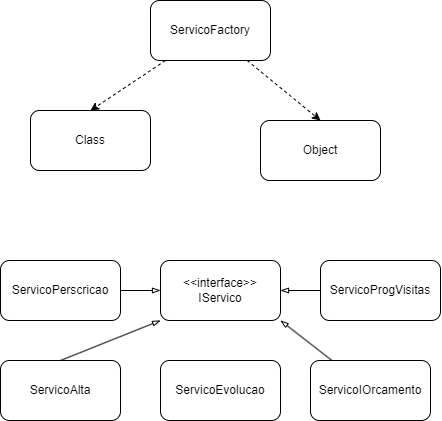

#Factory Method
A simple implementation of the Factory Method pattern in Java.

## Diagram

#Explanation
The Factory Method pattern is a creational pattern that provides an interface for creating objects in a superclass, but allows subclasses to alter the type of objects that will be created.
